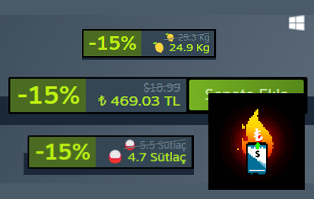

# Steam Türk Lirasına Çevirme

Steam Turkey Store now uses Dollars instead of Turkish Lira due to our fascinating economy. This plugin has been created by using the [Exchange Rate API](https://www.exchangerate-api.com), which calculates the prices according to the current exchange rate and shows them in Turkish lira instead of dollars.

Chrome Web Store: [Steam Türk Lirasına Çevirme](https://chromewebstore.google.com/detail/steam-t%C3%BCrk-liras%C4%B1na-%C3%A7evir/amjkkjgaoobiepemkmiefmmbdeeindoj),

---
**Bug reports, feature requests and pull requests are always welcome** 