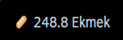
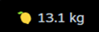
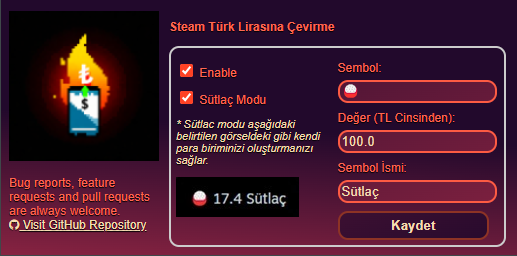

# Steam Türk Lirasına Çevirme

The Steam Türkiye Store now uses dollars instead of Turkish Lira due to our fascinating economy. This plugin calculates game prices based on the current exchange rate using the [Exchange Rate API](https://www.exchangerate-api.com), enabling them to be displayed in Turkish Lira.

Chrome Web Store: [Steam Türk Lirasına Çevirme](https://chromewebstore.google.com/detail/steam-t%C3%BCrk-liras%C4%B1na-%C3%A7evir/amjkkjgaoobiepemkmiefmmbdeeindoj),

## Sütlaç Modu
You can create your own currency using "Sütlaç Mode". You can see how many rice puddings 🍚, how many breads 🥖 or how many kilos of lemons 🍋 you can buy for the price of a game you like on Steam, without the hassle of calculating. In this way, you can reconsider your priorities. 🚀

Example custom currencies: 

---
**Bug reports, feature requests and pull requests are always welcome** 
